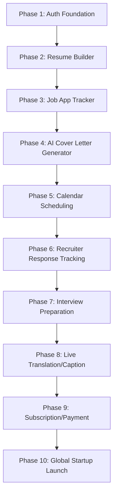

# Product Roadmap

This roadmap outlines the milestones for the Job Finder Agent startup.

---

## Roadmap Phases

### Phase Details

1. **Phase 1: Auth Foundation** (Current Milestone)
   - Establish monorepo structure.
   - Build Next.js & Flutter authentication pages/screens.
   - Supabase schema migrations (profiles table with trigger).
   - Setup GitHub Actions.

2. **Phase 2: Resume Builder**
   - Implement interactive resume creator using Tailwind UI.
   - AI keyword optimization engine.

3. **Phase 3: Job Application Tracker**
   - Kanban-style dashboard for managing status (Applied, Interviewing, Offered, Rejected).

4. **Phase 4: AI Cover Letter Generator**
   - Auto-generate highly tailored cover letters matching job descriptions.

5. **Phase 5: Calendar Scheduling**
   - Connect Google, Apple, and Outlook calendars.
   - Coordinate interview slots with recruiters.

6. **Phase 6: Recruiter Response Tracking**
   - Ingest email alerts to automatically log responses.

7. **Phase 7: Interview Preparation**
   - AI voice and chat interview simulation.

8. **Phase 8: Live Translation/Caption Mode**
   - Real-time transcription and translation helper during interviews (with explicit user consent).

9. **Phase 9: Subscription/Payment**
   - Stripe integration for premium plan subscriptions.

10. **Phase 10: Global Startup Launch**
    - Deploy apps to Vercel (Web), Google Play Store, and Apple App Store.
